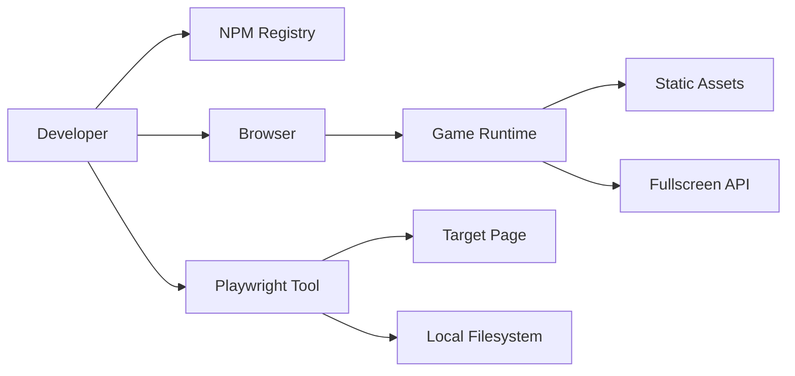

## Executive summary
This repository is a local-first static browser game with no backend, no auth, and no sensitive user-data handling in current scope. The most meaningful risks are software supply-chain integrity (`npm` dependencies/build artifacts) and misuse of local developer tooling (`tools/web_game_playwright_client.js`) rather than direct remote exploitation of runtime game logic.

## Scope and assumptions
- In scope: `index.html`, `src/**`, `package.json`, `package-lock.json`, `tools/web_game_playwright_client.js`, `tools/actions/**`, `tools/imagegen/**`.
- Out of scope: `node_modules/**`, `dist/**`, `.git/**`, deployment/CDN configs not present in repo.
- Confirmed context (user-provided): local development only (`A`), no sensitive data handling (`A`), Playwright helper not run in CI/shared automation (`A`).
- Assumption: developers still run `npm install`/`npm run build` locally for development.
- Assumption: if this project is later public-hosted, threat priorities must be recalibrated.

Open questions that would materially change ranking:
- None for current context; future internet exposure or CI adoption would materially increase priorities.

## System model
### Primary components
- Browser game runtime: `src/main.ts`, `src/game/Game.ts`, `src/game/*`.
- Static asset loader: `src/game/assets.ts` + `src/assets/**`.
- Dev/build toolchain: Vite/TypeScript via `package.json` scripts.
- Optional local automation tool: `tools/web_game_playwright_client.js` (Node + Playwright).
- Optional image prompt catalog for asset generation: `tools/imagegen/game-assets.jsonl`.

### Data flows and trust boundaries
- Local user input -> Browser game runtime  
  Data: keyboard/click events; Channel: DOM events; Security guarantees: browser same-origin policy only; Validation: event code checks in `InputState`.
  Evidence: `src/main.ts:43`, `src/main.ts:48`, `src/game/input.ts:9`.
- Browser runtime -> In-memory game state  
  Data: movement/jump/control signals and state transitions; Channel: in-process JS calls; Security guarantees: none beyond local process integrity; Validation: bounded physics via clamp/step logic.
  Evidence: `src/main.ts:68`, `src/game/Game.ts:195`.
- Browser runtime -> Static assets  
  Data: local bundled SVG/image resources; Channel: module-imported URLs and `Image.src`; Security guarantees: same-origin static serving; Validation: load success/fallback.
  Evidence: `src/game/assets.ts:1`, `src/game/assets.ts:31`, `src/main.ts:35`.
- Browser runtime -> Browser fullscreen API  
  Data: fullscreen requests; Channel: Web API; Security guarantees: browser permission model/user gesture requirements; Validation: keybound toggle and exception handling.
  Evidence: `src/main.ts:48`, `src/main.ts:131`.
- Local operator -> Playwright helper  
  Data: CLI args (`--url`, `--actions-file`, `--screenshot-dir`); Channel: local process args/filesystem; Security guarantees: none in script; Validation: minimal arg parsing and JSON parse.
  Evidence: `tools/web_game_playwright_client.js:5`, `tools/web_game_playwright_client.js:299`.
- Playwright helper -> Target web page and local filesystem  
  Data: page content, screenshots, state JSON, errors JSON; Channel: HTTP/HTTPS + local file writes; Security guarantees: browser sandbox only; Validation: output path existence creation only.
  Evidence: `tools/web_game_playwright_client.js:282`, `tools/web_game_playwright_client.js:327`, `tools/web_game_playwright_client.js:73`.
- Developer workstation -> npm registry/dependencies  
  Data: packages and transitive code; Channel: npm network install/build chain; Security guarantees: lockfile/integrity metadata; Validation: no repo-native policy checks.
  Evidence: `package.json:6`, `package-lock.json`.

#### Diagram

## Assets and security objectives
| Asset | Why it matters | Security objective (C/I/A) |
|---|---|---|
| Source code in `src/**` | Governs runtime behavior and shipped logic | Integrity |
| Build/dependency chain (`package-lock.json`, `npm install`) | Compromise can inject malicious code into dev or artifacts | Integrity, Confidentiality |
| Local developer environment | Could be abused by malicious dependency/tool execution | Confidentiality, Integrity, Availability |
| Optional screenshots/state outputs (`output/web-game`) | May contain unintended captured page/state info | Confidentiality |
| Local game availability | Excessive loops/actions can stall browser or local runner | Availability |

## Attacker model
### Capabilities
- Can publish or compromise npm dependencies/transitives consumed during local install/build.
- Can socially engineer a developer to run tooling commands with attacker-chosen parameters.
- Can tamper with local non-hardened static hosting if deployment controls are weak (future scenario).

### Non-capabilities
- No direct remote API access path: repository has no backend endpoint/service listener.
- No auth/session/token surface in runtime code to steal from app logic.
- No multi-tenant data plane in current project context.
- Per user confirmation: no CI/shared automation execution path for Playwright tool.

## Entry points and attack surfaces
| Surface | How reached | Trust boundary | Notes | Evidence (repo path / symbol) |
|---|---|---|---|---|
| `keydown` handlers | Local keyboard input | User -> Browser runtime | Controls movement/fullscreen; local abuse mainly availability/UI | `src/main.ts:48`, `src/game/input.ts:10` |
| `#start-btn` click | Local DOM interaction | User -> Browser runtime | Starts/restarts round; no privileged action | `index.html:12`, `src/main.ts:43` |
| Global hooks (`render_game_to_text`, `advanceTime`) | Any same-origin script/runtime context | Script context -> Game internals | Useful for testing; also enables local state tamper/automation | `src/main.ts:66`, `src/main.ts:78` |
| Asset loading | Bundled static URLs | Runtime -> Static resource loader | Failed loads fall back; integrity depends on served artifacts | `src/game/assets.ts:1`, `src/game/assets.ts:41` |
| Playwright `--url` | Local CLI arg | Operator -> External page | Opens arbitrary URL; interacts and captures output | `tools/web_game_playwright_client.js:20`, `tools/web_game_playwright_client.js:282` |
| Playwright `--actions-file/--actions-json` | Local file/arg JSON | Operator/file -> Tool parser | JSON parsed without schema/limits | `tools/web_game_playwright_client.js:299`, `tools/web_game_playwright_client.js:304` |
| Playwright `--screenshot-dir` | Local CLI arg | Operator -> Filesystem | Tool creates directory and writes files there | `tools/web_game_playwright_client.js:32`, `tools/web_game_playwright_client.js:73` |
| npm install/build | Developer action | Workstation -> Supply chain | Dependency compromise affects integrity | `package.json:6`, `package-lock.json` |

## Top abuse paths
1. Attacker compromises a dependency in the npm graph -> developer runs `npm install`/`npm run build` -> malicious code executes in dev environment -> altered artifacts or local compromise.
2. Attacker convinces developer to run Playwright helper against malicious URL -> helper loads attacker page and simulates input -> captured screenshots/state outputs include unintended content -> local confidentiality loss.
3. Attacker influences Playwright args in a scripted workflow -> `--screenshot-dir` points to sensitive/important location -> tool writes `shot-*.png/state-*.json` -> local file clobber/disruption.
4. Attacker supplies huge/unbounded action payload (`frames` very large) -> tool loops stepping frames -> local CPU/resource exhaustion and workflow stall.
5. If project later hosted publicly without hardening, attacker tampers with static JS/assets on host/CDN -> users receive modified game code -> integrity compromise of delivered client.
6. Same-origin script (or browser extension with page access) invokes `window.advanceTime`/state hooks -> bypasses normal play constraints -> gameplay integrity manipulation (non-sensitive but relevant for fairness).

## Threat model table
| Threat ID | Threat source | Prerequisites | Threat action | Impact | Impacted assets | Existing controls (evidence) | Gaps | Recommended mitigations | Detection ideas | Likelihood | Impact severity | Priority |
|---|---|---|---|---|---|---|---|---|---|---|---|---|
| TM-001 | Supply-chain attacker | Dependency in npm graph is compromised and developer installs/builds locally. | Inject malicious code via transitive package or lockfile tampering. | Local environment compromise or malicious build output. | Source/build integrity, developer environment | Small dependency set and lockfile present (`package.json:11`, `package-lock.json`). | No repo-level dependency policy checks or provenance checks. | Use `npm ci` in controlled env, add lockfile review policy, enable Dependabot/Renovate + audit gates, pin Node version, consider provenance verification in release workflow. | Alert on lockfile drift, CI audit report, checksum/provenance failures. | medium | high | high |
| TM-002 | Social engineering attacker | Developer runs Playwright helper with attacker-controlled URL. | Abuse `--url` to drive browser to hostile page and produce artifacts. | Unintended data capture in screenshots/state files; potential confusion during validation. | Local output confidentiality, workflow integrity | Tool is local-only and manually invoked (`tools/web_game_playwright_client.js:262`). | No URL allowlist or safety prompt; no hostname restrictions. | Default-deny non-`localhost` URLs unless `--allow-remote` is explicit; print warning banners for remote hosts. | Log and review target hostname for each run; fail closed on unexpected hostnames. | low | medium | low |
| TM-003 | Misconfigured automation/user error | Playwright helper receives unsafe `--screenshot-dir` path. | Writes artifacts into unintended directories and overwrites known filenames. | Local file clobber and disruption. | Local filesystem integrity/availability | Writes fixed filenames (`shot-*`, `state-*`) and creates dir recursively (`tools/web_game_playwright_client.js:73`, `tools/web_game_playwright_client.js:327`). | Path is unconstrained and unvalidated against allowed workspace roots. | Enforce workspace-relative output path; reject absolute/parent-traversal paths; add `--safe-output-root`. | Emit canonical output path in logs; monitor for writes outside workspace. | low | medium | low |
| TM-004 | Malicious or malformed action payload | Operator feeds untrusted JSON action definitions. | Use very large `frames`/iterations to force long loops and heavy CPU use. | Local denial of service during testing. | Local machine availability | Basic action parsing exists (`tools/web_game_playwright_client.js:299`). | No schema limits for `frames`, steps length, or iterations upper bound. | Add schema validation and hard limits (`maxFrames`, `maxSteps`, `maxIterations`), timeout budget, and early abort. | Track runtime duration and abort reason; surface anomalies in run summary. | low | low | low |
| TM-005 | Static hosting attacker (future) | Project becomes internet-hosted without strong artifact/deploy controls. | Tamper with served JS/assets. | Delivered-client integrity loss for players. | Runtime code integrity | None in repo (no deploy hardening config present). | No signed artifact pipeline / no documented integrity checks. | If hosted, use immutable hashed assets, controlled CI release, and host-level integrity protections (strict deployment perms, signed artifacts). | Compare deployed hashes to build output; monitor unexpected asset hash changes. | low | high | medium |
| TM-006 | Same-origin script manipulator | Attacker can execute script in same browser context (extension/injected script/local console). | Call exposed global hooks to manipulate state progression and game behavior. | Gameplay integrity/fairness issues only. | Game state integrity | Hooks intentionally exposed for testing (`src/main.ts:66`, `src/main.ts:78`). | No separation between test and production exposure. | Gate hooks behind debug flag/build mode; hide in production bundles if fairness matters. | Add runtime flag telemetry for hook usage in production builds. | medium | low | low |

## Criticality calibration
For this repository and confirmed context (local-only, no sensitive data, no CI automation), priorities are calibrated as:

- critical: direct developer workstation compromise with high confidence and no meaningful prerequisite barrier; or proven secret exfiltration path from this repo's runtime/tooling.
  - Example: malicious dependency executes arbitrary code during install and steals local credentials.
  - Example: automation path with external input allows arbitrary command execution on developer host.
- high: realistic integrity compromise of shipped artifacts or local dev workflow with substantial impact but requiring one meaningful precondition.
  - Example: lockfile/dependency tampering resulting in malicious game bundle.
  - Example: deployment artifact tampering in a future hosted configuration.
- medium: security-relevant abuse requiring specific misuse or future architecture changes, with bounded blast radius.
  - Example: Playwright remote URL misuse causing unintended capture.
  - Example: output path misuse clobbering local non-sensitive files.
- low: local abuse with limited impact, no sensitive data exposure, or mostly game fairness/availability effects.
  - Example: oversized action payload causing runner slowdown.
  - Example: client-side cheat via debug hooks.

## Focus paths for security review
| Path | Why it matters | Related Threat IDs |
|---|---|---|
| `package.json` | Defines dependency and build execution surface. | TM-001 |
| `package-lock.json` | Lockfile integrity anchors supply-chain risk. | TM-001 |
| `tools/web_game_playwright_client.js` | Accepts URL/path/action inputs and performs network + filesystem operations. | TM-002, TM-003, TM-004 |
| `src/main.ts` | Exposes global testing hooks and fullscreen/input event boundaries. | TM-006 |
| `src/game/input.ts` | Keyboard input normalization and control capture point. | TM-006 |
| `src/game/assets.ts` | Static resource loading boundary and fallback behavior. | TM-005 |
| `tools/imagegen/game-assets.jsonl` | Prompt catalog for future external generation workflows. | TM-001 (process hygiene), TM-005 (future pipeline) |

## Notes on use
- This threat model separates runtime game behavior (`src/**`) from developer tooling (`tools/**`) and from package supply chain concerns.
- User clarifications (A/A/A) were applied directly; if exposure changes (public hosting, sensitive data, CI automation), rerun and re-rank.
- Coverage check:
  - All discovered entry points are included in the attack-surface table.
  - Each trust boundary appears in at least one abuse path/threat.
  - Runtime vs tooling scope is explicitly separated.
